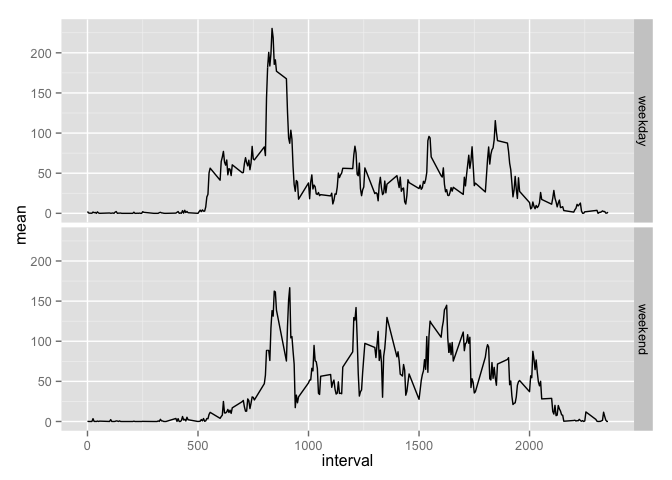

Code for reading in the dataset and/or processing the data (ignore misiing values) Histogram of the total number of steps taken each day

``` {.r}
activity<-read.csv("activity.csv", header=TRUE)
activity.filter<-na.omit(activity)
steps_sum<-aggregate(activity.filter$steps, by=list(Category=activity.filter$date), FUN=sum)
hist(steps_sum$x, main="Histogram of total steps per day", xlab="Total steps")
```

<!-- -->

``` {.r}
steps_mean<-aggregate(activity.filter$steps, by=list(Category=activity.filter$date), FUN=mean)
steps_median<-aggregate(activity.filter$steps, by=list(Category=activity.filter$date), FUN=median)
```

Mean number of steps taken each day, ignoring missing values

``` {.r}
steps_mean
```

    ##      Category          x
    ## 1  2012-10-02  0.4375000
    ## 2  2012-10-03 39.4166667
    ## 3  2012-10-04 42.0694444
    ## 4  2012-10-05 46.1597222
    ## 5  2012-10-06 53.5416667
    ## 6  2012-10-07 38.2465278
    ## 7  2012-10-09 44.4826389
    ## 8  2012-10-10 34.3750000
    ## 9  2012-10-11 35.7777778
    ## 10 2012-10-12 60.3541667
    ## 11 2012-10-13 43.1458333
    ## 12 2012-10-14 52.4236111
    ## 13 2012-10-15 35.2048611
    ## 14 2012-10-16 52.3750000
    ## 15 2012-10-17 46.7083333
    ## 16 2012-10-18 34.9166667
    ## 17 2012-10-19 41.0729167
    ## 18 2012-10-20 36.0937500
    ## 19 2012-10-21 30.6284722
    ## 20 2012-10-22 46.7361111
    ## 21 2012-10-23 30.9652778
    ## 22 2012-10-24 29.0104167
    ## 23 2012-10-25  8.6527778
    ## 24 2012-10-26 23.5347222
    ## 25 2012-10-27 35.1354167
    ## 26 2012-10-28 39.7847222
    ## 27 2012-10-29 17.4236111
    ## 28 2012-10-30 34.0937500
    ## 29 2012-10-31 53.5208333
    ## 30 2012-11-02 36.8055556
    ## 31 2012-11-03 36.7048611
    ## 32 2012-11-05 36.2465278
    ## 33 2012-11-06 28.9375000
    ## 34 2012-11-07 44.7326389
    ## 35 2012-11-08 11.1770833
    ## 36 2012-11-11 43.7777778
    ## 37 2012-11-12 37.3784722
    ## 38 2012-11-13 25.4722222
    ## 39 2012-11-15  0.1423611
    ## 40 2012-11-16 18.8923611
    ## 41 2012-11-17 49.7881944
    ## 42 2012-11-18 52.4652778
    ## 43 2012-11-19 30.6979167
    ## 44 2012-11-20 15.5277778
    ## 45 2012-11-21 44.3993056
    ## 46 2012-11-22 70.9270833
    ## 47 2012-11-23 73.5902778
    ## 48 2012-11-24 50.2708333
    ## 49 2012-11-25 41.0902778
    ## 50 2012-11-26 38.7569444
    ## 51 2012-11-27 47.3819444
    ## 52 2012-11-28 35.3576389
    ## 53 2012-11-29 24.4687500

Median number of steps taken each day, ignoring missing values

``` {.r}
steps_median
```

    ##      Category x
    ## 1  2012-10-02 0
    ## 2  2012-10-03 0
    ## 3  2012-10-04 0
    ## 4  2012-10-05 0
    ## 5  2012-10-06 0
    ## 6  2012-10-07 0
    ## 7  2012-10-09 0
    ## 8  2012-10-10 0
    ## 9  2012-10-11 0
    ## 10 2012-10-12 0
    ## 11 2012-10-13 0
    ## 12 2012-10-14 0
    ## 13 2012-10-15 0
    ## 14 2012-10-16 0
    ## 15 2012-10-17 0
    ## 16 2012-10-18 0
    ## 17 2012-10-19 0
    ## 18 2012-10-20 0
    ## 19 2012-10-21 0
    ## 20 2012-10-22 0
    ## 21 2012-10-23 0
    ## 22 2012-10-24 0
    ## 23 2012-10-25 0
    ## 24 2012-10-26 0
    ## 25 2012-10-27 0
    ## 26 2012-10-28 0
    ## 27 2012-10-29 0
    ## 28 2012-10-30 0
    ## 29 2012-10-31 0
    ## 30 2012-11-02 0
    ## 31 2012-11-03 0
    ## 32 2012-11-05 0
    ## 33 2012-11-06 0
    ## 34 2012-11-07 0
    ## 35 2012-11-08 0
    ## 36 2012-11-11 0
    ## 37 2012-11-12 0
    ## 38 2012-11-13 0
    ## 39 2012-11-15 0
    ## 40 2012-11-16 0
    ## 41 2012-11-17 0
    ## 42 2012-11-18 0
    ## 43 2012-11-19 0
    ## 44 2012-11-20 0
    ## 45 2012-11-21 0
    ## 46 2012-11-22 0
    ## 47 2012-11-23 0
    ## 48 2012-11-24 0
    ## 49 2012-11-25 0
    ## 50 2012-11-26 0
    ## 51 2012-11-27 0
    ## 52 2012-11-28 0
    ## 53 2012-11-29 0

Time series plot of the average number of steps taken

``` {.r}
steps_mean_interval<-aggregate(activity.filter$steps, by=list(Category=activity.filter$interval), FUN=mean)
plot(as.numeric(steps_mean_interval$Category), as.numeric(steps_mean_interval$x), type="l", xlab="intervals", ylab="mean")
```

<!-- -->

The 5-minute interval that, on average, contains the maximum number of steps

``` {.r}
steps_mean_interval[which(steps_mean_interval$x==max(steps_mean_interval$x)), ]
```

    ##     Category        x
    ## 104      835 206.1698

Code to describe and show a strategy for imputing missing data

``` {.r}
a.na<-activity[!complete.cases(activity), ]
fill<-merge(a.na, steps_mean_interval, by.x="interval", by.y="Category", all.x=TRUE)
fill$steps=fill$x
fill<-fill[, c(2,3,1)]
new<-rbind(activity.filter, fill)
```

Histogram of the total number of steps taken each day after missing values are imputed

``` {.r}
new_sum<-aggregate(new$steps, by=list(Category=new$date), FUN=sum)
hist(new_sum$x, main="Histogram of total steps per day", xlab="Total steps")
```

<!-- -->

``` {.r}
new_mean<-aggregate(new$steps, by=list(Category=new$date), FUN=mean)
new_median<-aggregate(new$steps, by=list(Category=new$date), FUN=median)
```

mean without missing values vs. imputed missing values

``` {.r}
merge(steps_mean, new_mean, by="Category", all=TRUE)
```

    ##      Category        x.x        x.y
    ## 1  2012-10-01         NA 37.3825996
    ## 2  2012-10-02  0.4375000  0.4375000
    ## 3  2012-10-03 39.4166667 39.4166667
    ## 4  2012-10-04 42.0694444 42.0694444
    ## 5  2012-10-05 46.1597222 46.1597222
    ## 6  2012-10-06 53.5416667 53.5416667
    ## 7  2012-10-07 38.2465278 38.2465278
    ## 8  2012-10-08         NA 37.3825996
    ## 9  2012-10-09 44.4826389 44.4826389
    ## 10 2012-10-10 34.3750000 34.3750000
    ## 11 2012-10-11 35.7777778 35.7777778
    ## 12 2012-10-12 60.3541667 60.3541667
    ## 13 2012-10-13 43.1458333 43.1458333
    ## 14 2012-10-14 52.4236111 52.4236111
    ## 15 2012-10-15 35.2048611 35.2048611
    ## 16 2012-10-16 52.3750000 52.3750000
    ## 17 2012-10-17 46.7083333 46.7083333
    ## 18 2012-10-18 34.9166667 34.9166667
    ## 19 2012-10-19 41.0729167 41.0729167
    ## 20 2012-10-20 36.0937500 36.0937500
    ## 21 2012-10-21 30.6284722 30.6284722
    ## 22 2012-10-22 46.7361111 46.7361111
    ## 23 2012-10-23 30.9652778 30.9652778
    ## 24 2012-10-24 29.0104167 29.0104167
    ## 25 2012-10-25  8.6527778  8.6527778
    ## 26 2012-10-26 23.5347222 23.5347222
    ## 27 2012-10-27 35.1354167 35.1354167
    ## 28 2012-10-28 39.7847222 39.7847222
    ## 29 2012-10-29 17.4236111 17.4236111
    ## 30 2012-10-30 34.0937500 34.0937500
    ## 31 2012-10-31 53.5208333 53.5208333
    ## 32 2012-11-01         NA 37.3825996
    ## 33 2012-11-02 36.8055556 36.8055556
    ## 34 2012-11-03 36.7048611 36.7048611
    ## 35 2012-11-04         NA 37.3825996
    ## 36 2012-11-05 36.2465278 36.2465278
    ## 37 2012-11-06 28.9375000 28.9375000
    ## 38 2012-11-07 44.7326389 44.7326389
    ## 39 2012-11-08 11.1770833 11.1770833
    ## 40 2012-11-09         NA 37.3825996
    ## 41 2012-11-10         NA 37.3825996
    ## 42 2012-11-11 43.7777778 43.7777778
    ## 43 2012-11-12 37.3784722 37.3784722
    ## 44 2012-11-13 25.4722222 25.4722222
    ## 45 2012-11-14         NA 37.3825996
    ## 46 2012-11-15  0.1423611  0.1423611
    ## 47 2012-11-16 18.8923611 18.8923611
    ## 48 2012-11-17 49.7881944 49.7881944
    ## 49 2012-11-18 52.4652778 52.4652778
    ## 50 2012-11-19 30.6979167 30.6979167
    ## 51 2012-11-20 15.5277778 15.5277778
    ## 52 2012-11-21 44.3993056 44.3993056
    ## 53 2012-11-22 70.9270833 70.9270833
    ## 54 2012-11-23 73.5902778 73.5902778
    ## 55 2012-11-24 50.2708333 50.2708333
    ## 56 2012-11-25 41.0902778 41.0902778
    ## 57 2012-11-26 38.7569444 38.7569444
    ## 58 2012-11-27 47.3819444 47.3819444
    ## 59 2012-11-28 35.3576389 35.3576389
    ## 60 2012-11-29 24.4687500 24.4687500
    ## 61 2012-11-30         NA 37.3825996

median without missing values vs. imputed missing values

``` {.r}
merge(steps_median, new_median, by="Category", all=TRUE)
```

    ##      Category x.x      x.y
    ## 1  2012-10-01  NA 34.11321
    ## 2  2012-10-02   0  0.00000
    ## 3  2012-10-03   0  0.00000
    ## 4  2012-10-04   0  0.00000
    ## 5  2012-10-05   0  0.00000
    ## 6  2012-10-06   0  0.00000
    ## 7  2012-10-07   0  0.00000
    ## 8  2012-10-08  NA 34.11321
    ## 9  2012-10-09   0  0.00000
    ## 10 2012-10-10   0  0.00000
    ## 11 2012-10-11   0  0.00000
    ## 12 2012-10-12   0  0.00000
    ## 13 2012-10-13   0  0.00000
    ## 14 2012-10-14   0  0.00000
    ## 15 2012-10-15   0  0.00000
    ## 16 2012-10-16   0  0.00000
    ## 17 2012-10-17   0  0.00000
    ## 18 2012-10-18   0  0.00000
    ## 19 2012-10-19   0  0.00000
    ## 20 2012-10-20   0  0.00000
    ## 21 2012-10-21   0  0.00000
    ## 22 2012-10-22   0  0.00000
    ## 23 2012-10-23   0  0.00000
    ## 24 2012-10-24   0  0.00000
    ## 25 2012-10-25   0  0.00000
    ## 26 2012-10-26   0  0.00000
    ## 27 2012-10-27   0  0.00000
    ## 28 2012-10-28   0  0.00000
    ## 29 2012-10-29   0  0.00000
    ## 30 2012-10-30   0  0.00000
    ## 31 2012-10-31   0  0.00000
    ## 32 2012-11-01  NA 34.11321
    ## 33 2012-11-02   0  0.00000
    ## 34 2012-11-03   0  0.00000
    ## 35 2012-11-04  NA 34.11321
    ## 36 2012-11-05   0  0.00000
    ## 37 2012-11-06   0  0.00000
    ## 38 2012-11-07   0  0.00000
    ## 39 2012-11-08   0  0.00000
    ## 40 2012-11-09  NA 34.11321
    ## 41 2012-11-10  NA 34.11321
    ## 42 2012-11-11   0  0.00000
    ## 43 2012-11-12   0  0.00000
    ## 44 2012-11-13   0  0.00000
    ## 45 2012-11-14  NA 34.11321
    ## 46 2012-11-15   0  0.00000
    ## 47 2012-11-16   0  0.00000
    ## 48 2012-11-17   0  0.00000
    ## 49 2012-11-18   0  0.00000
    ## 50 2012-11-19   0  0.00000
    ## 51 2012-11-20   0  0.00000
    ## 52 2012-11-21   0  0.00000
    ## 53 2012-11-22   0  0.00000
    ## 54 2012-11-23   0  0.00000
    ## 55 2012-11-24   0  0.00000
    ## 56 2012-11-25   0  0.00000
    ## 57 2012-11-26   0  0.00000
    ## 58 2012-11-27   0  0.00000
    ## 59 2012-11-28   0  0.00000
    ## 60 2012-11-29   0  0.00000
    ## 61 2012-11-30  NA 34.11321

Panel plot comparing the average number of steps taken per 5-minute interval across weekdays and weekends All of the R code needed to reproduce the results (numbers, plots, etc.) in the report

``` {.r}
new$date<-as.Date(new$date)
library(chron)
new$weekend<-chron::is.weekend(new$date)
weekday<-new[which(new$weekend=='FALSE'), ]
weekend<-new[which(new$weekend=='TRUE'), ]
weekday_mean_interval<-aggregate(weekday$steps, by=list(Category=weekday$interval), FUN=mean)
weekend_mean_interval<-aggregate(weekend$steps, by=list(Category=weekend$interval), FUN=mean)
par(mfrow=c(2,1))
plot(as.numeric(weekday_mean_interval$Category), as.numeric(weekday_mean_interval$x), type="l", xlab="intervals", ylab="mean", main="weekday")
plot(as.numeric(weekend_mean_interval$Category), as.numeric(weekend_mean_interval$x), type="l", xlab="intervals", ylab="mean", main="weekend")
```

<!-- -->
